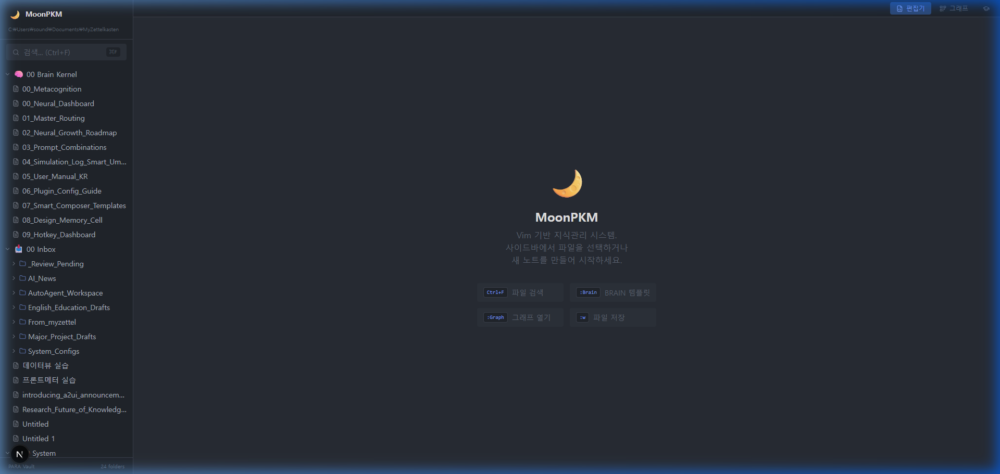
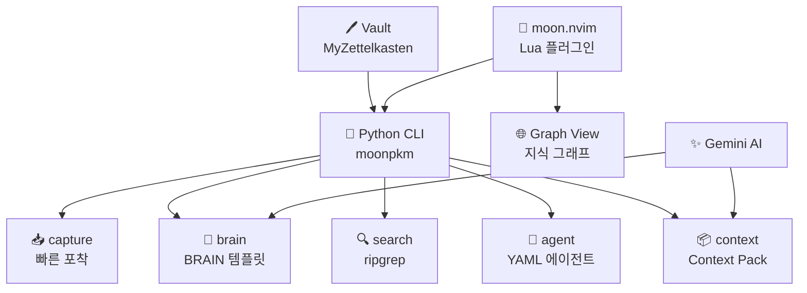

<div align="center">

# 🌙 MoonPKM

### *Vim 기반 에이전틱 지식관리 시스템*

**노트를 쓰는 것이 아니라, 지식을 작동시킨다.**

[](https://github.com/Reasonofmoon/moonpkm)
[](https://github.com/Reasonofmoon/moonpkm/tree/master/cli)
[](https://github.com/Reasonofmoon/moonpkm/tree/master/nvim)
[](LICENSE)

> **"생각의 흐름을 끊지 않고 지식을 쌓는 시스템이 있다면?"**  
> MoonPKM은 Vim + Python CLI + Gemini AI로 작동하는 로컬 퍼스트 PKM이다.  
> 노트 앱을 여는 대신, 에디터를 떠나지 않고 생각을 포착하고 연결한다.

[🚀 빠른 시작](#-시작하기) · [📖 Vim 입문 가이드](#-vimtutor-데일리-미션) · [🐛 이슈](../../issues)

</div>

---



## 🧠 Philosophy — "왜 만들었는가"

| 기준 | 기존 PKM (Obsidian 앱) | MoonPKM |
|------|----------------------|---------|
| 컨텍스트 전환 | 에디터 → 앱 전환 필요 | **Vim 안에서 모두 해결** |
| 자동화 | 수동 정리 | **YAML 에이전트로 자동 처리** |
| AI 통합 | 별도 도구 필요 | **`moonpkm brain --ai` 한 줄** |
| 검색 속도 | 앱 내 검색 | **ripgrep 기반 8000+ 노트 즉시 검색** |
| Vim 학습 | 별도 학습 필요 | **내장 VimTutor: 데일리 미션 시스템** |



---

## ⚙️ 시스템 레이어

### Layer 1 · CLI Core (`moonpkm`)

```bash
moonpkm capture "오늘 떠오른 아이디어"      # Inbox 저장
moonpkm brain --new "메타인지"              # BRAIN 노트 생성
moonpkm search "제텔카스텐"                 # Vault 전체 검색
moonpkm status                              # 볼트 현황 대시보드
```

> **Wow**: `moonpkm status` — 8847개 노트를 1초 안에 PARA 구조로 시각화

### Layer 2 · YAML 에이전트 시스템

```yaml
# agents/daily-review.yaml
name: daily-review
description: 매일 아침 Inbox 처리 + SRS 리뷰 + 진행상황 리포트
steps:
  - action: read_inbox
  - action: classify_dikm
  - action: suggest_brain
  - action: report
```

```bash
moonpkm agent run daily-review     # 에이전트 실행
moonpkm agent list                 # 등록된 에이전트 목록
```

> **Wow**: YAML 에이전트를 추가하는 것만으로 자동화 파이프라인 완성

### Layer 3 · moon.nvim (Neovim 통합)

```lua
-- Vim 안에서 전체 PKM 제어
<leader>mc  -- Capture 빠른 입력
<leader>mb  -- BRAIN 섹션 삽입
<leader>ms  -- Vault 검색
<leader>ma  -- 에이전트 선택 · 실행
<leader>mk  -- Context Pack 생성
:MoonCapture  -- 현재 줄을 Inbox에
:MoonSearch   -- Vault 검색
```

> **Wow**: Vim을 벗어나지 않고 8847개 노트를 검색, 캡처, 연결

---

## 🎓 VimTutor 데일리 미션

Vim을 처음 접하는 사용자를 위한 **9단계 인터랙티브 학습 시스템**이 내장되어 있다.

- 앱 상단 **VimTutor 버튼** 클릭 또는 `http://localhost:3031` 접속
- 매일 1개 레슨, 순차 애니메이션으로 명령어 학습
- 챌린지 미션 완료 후 다음 단계 잠금 해제

| 단계 | 레슨 | 핵심 명령 |
|------|------|----------|
| 🟢 BASIC | Day 1–4 | `:q!`, `hjkl`, `w/b/e`, `dd/yy` |
| 🔵 NORMAL | Day 5–7 | `/검색`, Visual Mode, Macro |
| 🟣 ADVANCED | Day 8 | Text Objects (`ciw`, `ci"`) |
| 🌙 MOONPKM | Day 9 | `:MoonCapture`, `:MoonBrain` |

---

## 🎯 수준별 활용 가이드

### 🟢 Starter — "5분 안에 첫 노트 캡처"

```bash
# 1. 설치
cd moonpkm/cli && pip install -e .

# 2. 환경 설정
echo "MOON_VAULT=C:/Users/your/Documents/MyZettelkasten" > .env
echo "GEMINI_API_KEY=your-key" >> .env

# 3. 첫 캡처
moonpkm capture "첫 번째 아이디어"

# 4. 확인
moonpkm status
```

### 🔵 Professional — "BRAIN 템플릿 + AI 자동완성"

```bash
# BRAIN 노트 생성
moonpkm brain --new "메타인지란 무엇인가"

# AI가 BRAIN 섹션 자동완성
moonpkm brain "03 Permanent/메타인지.md" --ai

# Context Pack으로 글쓰기 재료 준비
moonpkm context "블로그 포스트: 메타인지" --ai
```

### 🟣 Enterprise — "에이전트 + moon.nvim 통합"

```lua
-- lazy.nvim 설치
{
  dir = "path/to/moonpkm/nvim/moon.nvim",
  config = function()
    require("moon").setup({
      vault_path = "C:/Users/your/Documents/MyZettelkasten",
      moon_cmd = "moonpkm",
    })
  end
}
```

---

## 🔧 확장

| 우선순위 | 방법 | 난이도 | 범위 |
|----------|------|--------|------|
| **1st** | `.env` 수정 (`MOON_VAULT`, `MOON_MODEL`) | ⭐ | 전역 |
| **2nd** | `agents/*.yaml` 추가 | ⭐⭐ | 자동화 |
| **3rd** | `moon/ai.py` 함수 확장 | ⭐⭐ | AI 기능 |
| **4th** | `nvim/moon.nvim` 키맵 커스텀 | ⭐⭐⭐ | Vim 통합 |

---

## 📦 기술 스택

| 레이어 | 기술 |
|--------|------|
| CLI | Python 3.10+, Click, Rich, PyYAML |
| Vault | python-frontmatter, ripgrep |
| AI | Google Gemini 2.0 Flash |
| Neovim | Lua 5.1+ |
| Web (Graph View) | Next.js 14, ReactFlow, CodeMirror 6 |
| 에이전트 | YAML, asyncio |

---

## 🐧 WSL / Linux 설치

```bash
# WSL 자동 감지 — /mnt/c/... 경로 자동 세팅
export MOON_VAULT="/mnt/c/Users/your/Documents/MyZettelkasten"
export GEMINI_API_KEY="your-key"

git clone https://github.com/Reasonofmoon/moonpkm.git
cd moonpkm/cli
pip install -e .

# 동작 확인
moonpkm status
moonpkm agent list
```

---

## 🌐 다국어 지원

| 항목 | 현황 |
|------|------|
| CLI 메시지 | 한국어 기본 |
| VimTutor | 한국어 |
| 코드 주석 | 한/영 병행 |
| README | 한국어 (영문 번역 예정) |

---

<div align="center">

**달의이성 (Reason Moon) 제작**  
[GitHub](https://github.com/Reasonofmoon) · [Issues](../../issues)

*"지식은 연결될 때 비로소 의미가 된다"*

</div>
